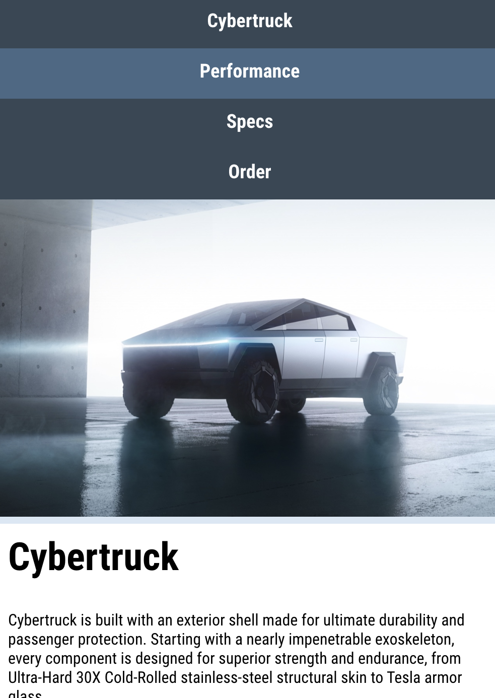

# Speed course Responsive HTML en CSS

Speed Course Responsive HTML and CSS

## Menu

- Menu bouwen met Flex, nav en div elementen
- Hover buttons
- Spring naar een section

## Responsive

- Responsive view in de browser
- Viewport tag
- Background image met cover
- Schalen met % en vw 
- Media Queries
- Menu layout

## Form

- Frontend validatie van formuliervelden

## Eindresultaat

